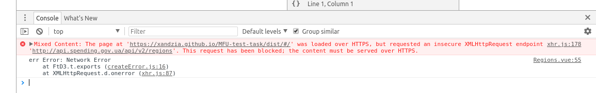
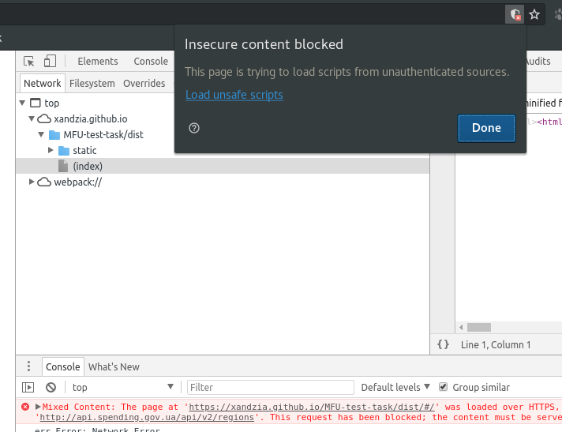

# MFU-test-task

> A Vue.js project

## Build Setup

``` bash
# install dependencies
npm install

# serve with hot reload at localhost:8080
npm run dev

# build for production with minification
npm run build

# build for production and view the bundle analyzer report
npm run build --report
```

For a detailed explanation on how things work, check out the [guide](http://vuejs-templates.github.io/webpack/) and [docs for vue-loader](http://vuejs.github.io/vue-loader).
## Demo
- if you have this response in console
- 
- click "Load unsafe scripts"
- 

### Notes
- [vue-axios](https://www.npmjs.com/package/vue-axios)
- if it has error "...No 'Access-Control-Allow-Origin'....", try [this](https://community.powerbi.com/t5/Developer/Error-No-Access-Control-Allow-Origin-header-is-present-on-the/m-p/351506#M10446):
  - add the [extension](https://chrome.google.com/webstore/detail/allow-control-allow-origi/nlfbmbojpeacfghkpbjhddihlkkiljbi?hl=en-US) in google chrome to allow access using CORS
  - or In Windows, paste this command in run window
  ```
  chrome.exe --user-data-dir="C:/Chrome dev session" --disable-web-security
  ```
